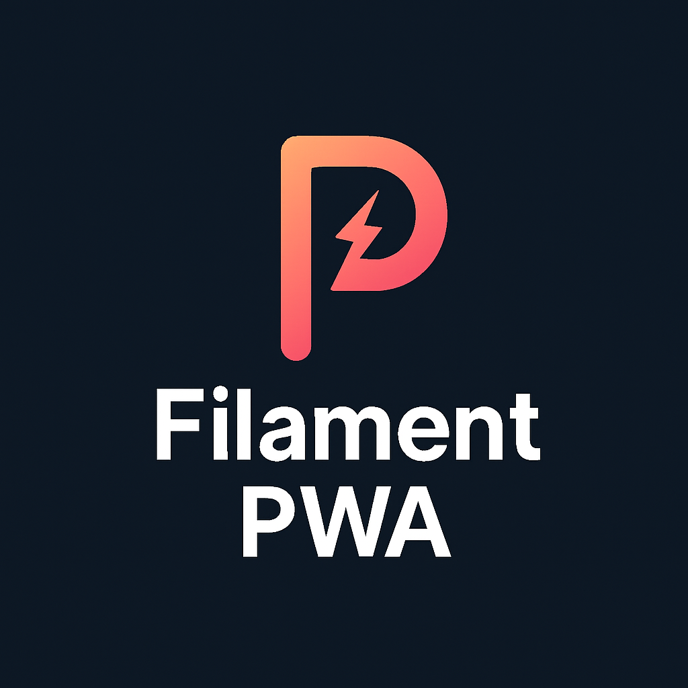

# Filament PWA Plugin



[](https://packagist.org/packages/alareqi/filament-pwa)
[](https://github.com/aymanalareqi/filament-pwa/actions?query=workflow%3Arun-tests+branch%3Amain)
[](https://github.com/aymanalareqi/filament-pwa/actions?query=workflow%3A"Fix+PHP+code+style+issues"+branch%3Amain)
[](https://packagist.org/packages/alareqi/filament-pwa)

A comprehensive Progressive Web App (PWA) plugin for Filament v3 and v4 admin panels. Transform your Filament admin panel into a fully-featured PWA with offline functionality, installation prompts, automatic icon generation, and comprehensive internationalization support.

## ✨ Features

- 🚀 **Complete PWA Implementation** - Full PWA compliance with manifest, service worker, and offline functionality
- 📱 **Smart Installation Prompts** - Intelligent installation banners with platform-specific instructions (iOS, Android, Desktop)
- 🎨 **Automatic Icon Generation** - Generate all required PWA icons from a single source image (SVG or PNG) with maskable icon support
- 🌐 **Comprehensive Offline Support** - Advanced caching strategies, offline fallback pages, and sync capabilities
- 🌍 **Full Internationalization** - Built-in translations for 10+ languages with RTL/LTR support
- 🔧 **Highly Configurable** - Extensive configuration options with fluent API and closure-based dynamic configuration
- 🎯 **Seamless Filament Integration** - Native integration with Filament v3 & v4 panels using render hooks
- 📊 **Validation & Debug Tools** - Built-in PWA validation, testing commands, and debug mode
- 🎨 **Smart Defaults** - Advanced auto-detection of theme colors, language, and text direction from Filament/Laravel configuration
- ⚡ **Performance Optimized** - Efficient caching strategies and minimal overhead

## 📋 Table of Contents

- [Requirements](#-requirements)
- [Installation & Setup](#-installation--setup)
- [Quick Start](#-quick-start)
- [Configuration](#-configuration)
- [Internationalization](#-internationalization)
- [Icon Generation](#-icon-generation)
- [Advanced Features](#-advanced-features)
- [Troubleshooting](#-troubleshooting)
- [API Reference](#-api-reference)
- [Contributing](#-contributing)

## 📋 Requirements

### System Requirements

- **PHP**: 8.2 or higher
- **Laravel**: 10.0 or higher
- **Filament**: 3.0 or 4.0

### Optional Dependencies

- **Imagick Extension** (recommended) - For high-quality icon generation
- **GD Extension** (fallback) - Basic image processing support
- **Intervention Image** (optional) - Enhanced image processing capabilities

### Browser Support

- **Chrome/Chromium** - Full PWA support
- **Firefox** - PWA support with some limitations
- **Safari** - Limited PWA support, manual installation required on iOS
- **Edge** - Full PWA support

### Production Requirements

- **HTTPS** - Required for PWA functionality in production
- **Valid SSL Certificate** - For secure service worker registration
- **Web Server** - Apache, Nginx, or similar with proper MIME type configuration

## 🚀 Installation & Setup

### Step 1: Install the Package

Install the package via Composer:

```bash
composer require alareqi/filament-pwa
```

> **Note**: This package supports both Filament v3 and v4. The installation process is identical for both versions.

### Step 2: Publish Assets (Optional)

Publish the configuration file and assets:

```bash
# Publish configuration file
php artisan vendor:publish --tag="filament-pwa-config"

# Publish views (for customization)
php artisan vendor:publish --tag="filament-pwa-views"

# Publish public assets
php artisan vendor:publish --tag="filament-pwa-assets"
```

### Step 3: Generate PWA Icons

Generate all required PWA icons from your logo:

```bash
# From SVG (recommended for best quality)
php artisan filament-pwa:setup --generate-icons --source=public/logo.svg

# From PNG/JPG
php artisan filament-pwa:setup --generate-icons --source=public/logo.png
```

### Step 4: Validate Setup

Validate your PWA configuration:

```bash
php artisan filament-pwa:setup --validate
```

## ⚡ Quick Start

### Method 1: Fluent API (Recommended)

Register the plugin in your Panel provider with fluent configuration:

```php
use Alareqi\FilamentPwa\FilamentPwaPlugin;

public function panel(Panel $panel): Panel
{
    return $panel
        ->plugins([
            FilamentPwaPlugin::make()
                ->name('My Admin Panel')
                ->shortName('Admin')
                ->description('Powerful admin panel for managing your application')
                ->themeColor('#3B82F6')
                ->backgroundColor('#ffffff')
                ->standalone()
                ->language('en')
                ->ltr()
                ->enableInstallation(2000) // Show prompt after 2 seconds
                ->addShortcut('Dashboard', '/admin', 'Main dashboard')
                ->addShortcut('Users', '/admin/users', 'Manage users')
                ->icons('images/icons', [72, 96, 128, 144, 152, 192, 384, 512])
                ->serviceWorker('my-app-v1.0.0', '/offline'),
        ]);
}
```

### Method 2: Configuration File

Alternatively, register the plugin and configure via config file:

```php
use Alareqi\FilamentPwa\FilamentPwaPlugin;

public function panel(Panel $panel): Panel
{
    return $panel
        ->plugins([
            FilamentPwaPlugin::make(),
        ]);
}
```

Then configure in `config/filament-pwa.php`:

```php
return [
    'name' => 'My Admin Panel',
    'short_name' => 'Admin',
    'description' => 'Powerful admin panel for managing your application',
    'theme_color' => '#3B82F6',
    'background_color' => '#ffffff',
    'display' => 'standalone',
    'installation' => [
        'enabled' => true,
        'prompt_delay' => 2000,
        'ios_instructions_delay' => 5000,
        'show_banner_in_debug' => true,
    ],
    'shortcuts' => [
        [
            'name' => 'Dashboard',
            'url' => '/admin',
            'description' => 'Main dashboard',
        ],
    ],
];
```

### Method 3: Dynamic Configuration with Closures

For advanced use cases, use closures for dynamic configuration:

```php
FilamentPwaPlugin::make()
    ->name(fn() => auth()->user()?->company_name ?? 'Admin Panel')
    ->themeColor(fn() => auth()->user()?->theme_color ?? '#3B82F6')
    ->language(fn() => auth()->user()?->language ?? app()->getLocale())
    ->direction(fn() => auth()->user()?->text_direction ?? 'ltr')
    ->addShortcut(fn() => [
        'name' => 'My Dashboard',
        'url' => '/admin/dashboard/' . auth()->id(),
        'description' => 'Personal dashboard',
    ])
```

## 🔧 Configuration

The plugin offers extensive configuration options through multiple approaches:

### Core Configuration Options

| Option | Type | Default | Description |
|--------|------|---------|-------------|
| `name` | `string\|Closure` | `config('app.name') . ' Admin'` | PWA application name |
| `short_name` | `string\|Closure` | `'Admin'` | Short name for home screen |
| `description` | `string\|Closure` | `'Admin panel for ' . config('app.name')` | App description |
| `start_url` | `string\|Closure` | `'/admin'` | Starting URL when app opens |
| `display` | `string` | `'standalone'` | Display mode (`standalone`, `fullscreen`, `minimal-ui`, `browser`) |
| `theme_color` | `string\|Closure` | Auto-detected from Filament | Theme color for browser UI |
| `background_color` | `string\|Closure` | `'#ffffff'` | Background color during loading |
| `orientation` | `string` | `'portrait-primary'` | Screen orientation preference |
| `scope` | `string` | `'/admin'` | Navigation scope |
| `lang` | `string\|Closure` | Auto-detected from Laravel | Language code |
| `dir` | `string\|Closure` | Auto-detected from language | Text direction (`ltr`, `rtl`) |

### Installation Configuration

```php
'installation' => [
    'enabled' => true,                    // Enable installation prompts
    'prompt_delay' => 2000,              // Delay before showing prompt (ms)
    'ios_instructions_delay' => 5000,    // Delay for iOS instructions (ms)
    'show_banner_in_debug' => true,      // Always show banner in debug mode
],
```

### Icon Configuration

```php
'icons' => [
    'path' => 'images/icons',            // Output directory for icons
    'sizes' => [72, 96, 128, 144, 152, 192, 384, 512], // Icon sizes to generate
    'maskable_sizes' => [192, 512],      // Maskable icon sizes
],
```

### Service Worker Configuration

```php
'service_worker' => [
    'cache_name' => 'filament-admin-v1.0.0',  // Cache name for versioning
    'offline_url' => '/offline',               // Offline fallback page
    'cache_urls' => [                          // URLs to cache immediately
        '/admin',
        '/admin/login',
        '/manifest.json',
    ],
    'cache_patterns' => [                      // Regex patterns for caching
        'filament_assets' => '/\/css\/filament\/|\/js\/filament\//',
        'images' => '/\.(png|jpg|jpeg|svg|gif|webp|ico)$/',
        'fonts' => '/\.(woff|woff2|ttf|eot)$/',
    ],
],
```

## 🌍 Internationalization

The plugin includes comprehensive internationalization support with built-in translations for 10+ languages and full RTL/LTR support.

### Supported Languages

| Language | Code | Direction | Status |
|----------|------|-----------|--------|
| English | `en` | LTR | ✅ Complete |
| Arabic | `ar` | RTL | ✅ Complete |
| Spanish | `es` | LTR | ✅ Complete |
| French | `fr` | LTR | ✅ Complete |
| German | `de` | LTR | ✅ Complete |
| Portuguese | `pt` | LTR | ✅ Complete |
| Italian | `it` | LTR | ✅ Complete |
| Russian | `ru` | LTR | ✅ Complete |
| Japanese | `ja` | LTR | ✅ Complete |
| Chinese (Simplified) | `zh-CN` | LTR | ✅ Complete |
| Dutch | `nl` | LTR | ✅ Complete |

### Language Configuration

#### Automatic Detection (Recommended)
The plugin automatically detects language and text direction from Laravel's configuration:

```php
// The plugin will automatically use Laravel's app locale
// and detect RTL languages (Arabic, Hebrew, Persian, etc.)
FilamentPwaPlugin::make()
    // Language and direction are auto-detected
```

#### Manual Configuration
```php
FilamentPwaPlugin::make()
    ->language('ar')  // Set specific language
    ->rtl()          // Set RTL direction

    // Or use LTR
    ->language('en')
    ->ltr()
```

#### Dynamic Language Configuration
```php
FilamentPwaPlugin::make()
    ->language(fn() => auth()->user()?->language ?? app()->getLocale())
    ->direction(fn() => auth()->user()?->text_direction ?? 'ltr')
```

### RTL Language Support

For RTL languages like Arabic, the plugin automatically:
- Sets `dir="rtl"` in the PWA manifest
- Provides culturally appropriate translations
- Handles text direction in installation prompts
- Supports RTL-aware UI components

```php
// Automatic RTL detection for Arabic
app()->setLocale('ar');

FilamentPwaPlugin::make()
    // Automatically detects Arabic and sets RTL direction
```

### Custom Translations

To add custom translations or modify existing ones:

1. **Publish the language files:**
   ```bash
   php artisan vendor:publish --tag="filament-pwa-lang"
   ```

2. **Modify translations in `resources/lang/{locale}/pwa.php`:**
   ```php
   // resources/lang/ar/pwa.php
   return [
       'install_title' => 'تثبيت التطبيق',
       'install_description' => 'احصل على تجربة أفضل مع التطبيق المثبت',
       // ... more translations
   ];
   ```

3. **Add new language support:**
   ```bash
   # Copy existing translation file
   cp resources/lang/en/pwa.php resources/lang/your-locale/pwa.php

   # Translate the content
   ```

### Translation Keys Reference

The plugin uses the following translation keys:

```php
// Installation prompts
'install_title', 'install_description', 'install_button', 'dismiss_button'

// iOS installation
'ios_install_title', 'ios_install_description', 'ios_step_1', 'ios_step_2', 'ios_step_3', 'got_it'

// Updates
'update_available', 'update_description', 'update_now', 'update_later'

// Offline functionality
'offline_title', 'offline_subtitle', 'offline_status', 'online_status'

// Features and actions
'available_features', 'retry_connection', 'go_home'

// Validation messages
'validation.manifest_missing', 'validation.service_worker_missing'

// Setup command messages
'setup.starting', 'setup.completed', 'setup.validation_passed'
```

## 🎨 Icon Generation

The plugin automatically generates all required PWA icons from a single source image with high-quality output and maskable icon support.

### Supported Source Formats

- **SVG (Recommended)** - Vector format provides the best quality at all sizes
- **PNG** - High-resolution raster images (minimum 512x512 recommended)
- **JPG** - Supported but PNG recommended for transparency

### Basic Icon Generation

```bash
# Generate from SVG (best quality)
php artisan filament-pwa:setup --generate-icons --source=public/logo.svg

# Generate from PNG
php artisan filament-pwa:setup --generate-icons --source=public/logo.png

# Generate from different path
php artisan filament-pwa:setup --generate-icons --source=/path/to/your/logo.svg
```

### Generated Icon Sizes

The plugin generates icons in the following sizes by default:
- **Standard Icons**: 72x72, 96x96, 128x128, 144x144, 152x152, 192x192, 384x384, 512x512
- **Maskable Icons**: 192x192, 512x512 (with safe area padding)
- **Favicon**: 32x32 (saved as favicon.ico)

### Maskable Icons

Maskable icons ensure your app icon looks great on all devices by providing a safe area:

```php
// Configure maskable icon sizes
'icons' => [
    'maskable_sizes' => [192, 512],  // Sizes for maskable icons
],
```

Maskable icons are automatically generated with:
- 80% safe area for the actual icon
- 20% padding around the edges
- Theme color background

### Advanced Icon Configuration

```php
// In your panel provider
FilamentPwaPlugin::make()
    ->icons(
        path: 'images/icons',                    // Output directory
        sizes: [72, 96, 128, 144, 152, 192, 384, 512], // Standard sizes
        maskableSizes: [192, 512]                // Maskable sizes
    )

// Or in config file
'icons' => [
    'path' => 'images/icons',
    'sizes' => [72, 96, 128, 144, 152, 192, 384, 512],
    'maskable_sizes' => [192, 512],
],
```

### Image Processing Requirements

The plugin uses different image processing libraries based on availability:

1. **Imagick (Recommended)** - Best quality, supports SVG natively
2. **GD Extension** - Fallback option, limited SVG support
3. **Intervention Image** - Enhanced image processing capabilities

Install Imagick for best results:
```bash
# Ubuntu/Debian
sudo apt-get install php-imagick

# macOS with Homebrew
brew install imagemagick
brew install php-imagick

# Windows
# Download from https://windows.php.net/downloads/pecl/releases/imagick/
```

### Troubleshooting Icon Generation

**Source image not found:**
```bash
# Ensure the source path is correct
php artisan filament-pwa:setup --generate-icons --source=public/your-logo.svg
```

**Poor quality icons:**
- Use SVG source for best quality
- Ensure PNG source is at least 512x512 pixels
- Install Imagick extension for better processing

**Permission errors:**
```bash
# Ensure the icons directory is writable
chmod 755 public/images/icons
```

### Manual Icon Placement

If you prefer to create icons manually, place them in the configured icons directory:

```
public/images/icons/
├── icon-72x72.png
├── icon-96x96.png
├── icon-128x128.png
├── icon-144x144.png
├── icon-152x152.png
├── icon-192x192.png
├── icon-192x192-maskable.png
├── icon-384x384.png
├── icon-512x512.png
└── icon-512x512-maskable.png
```

## 🚀 Advanced Features

### Debug Mode

Enable debug mode to always show installation prompts during development:

```php
FilamentPwaPlugin::make()
    ->enableDebugBanner()  // Always show installation banner in debug mode

// Or in config
'installation' => [
    'show_banner_in_debug' => true,
],
```

### Custom Service Worker

Extend the service worker functionality:

```php
// Configure caching strategies
FilamentPwaPlugin::make()
    ->serviceWorker(
        cacheName: 'my-app-v2.0.0',
        offlineUrl: '/custom-offline',
        cacheUrls: ['/admin', '/admin/dashboard', '/api/user']
    )
```

### App Shortcuts

Add shortcuts that appear when users long-press your app icon:

```php
FilamentPwaPlugin::make()
    ->addShortcut('Dashboard', '/admin', 'Main dashboard')
    ->addShortcut('Users', '/admin/users', 'Manage users')
    ->addShortcut('Settings', '/admin/settings', 'App settings')

    // Dynamic shortcuts
    ->addShortcut(fn() => [
        'name' => 'My Profile',
        'url' => '/admin/profile/' . auth()->id(),
        'description' => 'View my profile',
        'icons' => [['src' => '/images/profile-icon.png', 'sizes' => '96x96']],
    ])
```

### HTTPS Requirements

PWAs require HTTPS in production. The plugin validates this automatically:

```php
// Validation will check for HTTPS in production
php artisan filament-pwa:setup --validate
```

For development, you can use:
- Laravel Valet (automatic HTTPS)
- `php artisan serve` with `--host=localhost` (localhost is exempt from HTTPS requirement)
- ngrok for testing on mobile devices

### Performance Optimization

The plugin includes several performance optimizations:

```php
// Efficient caching strategies
'service_worker' => [
    'cache_patterns' => [
        'filament_assets' => '/\/css\/filament\/|\/js\/filament\//',  // Cache Filament assets
        'images' => '/\.(png|jpg|jpeg|svg|gif|webp|ico)$/',          // Cache images
        'fonts' => '/\.(woff|woff2|ttf|eot)$/',                      // Cache fonts
    ],
],
```

## 🎨 Automatic Color Detection

The plugin automatically detects and uses your Filament panel's primary color for the PWA installation banner and other UI elements. The color detection system works with both Filament v3 and v4:

### Detection Priority

1. **Current Panel Context** - Colors from the active panel (highest priority)
2. **Runtime Panel Detection** - Detected from current route/request context
3. **Admin Panel** - Default admin panel colors
4. **Any Available Panel** - First available panel colors
5. **Configuration Files** - Filament config file colors
6. **Fallback Color** - `#6366f1` (Tailwind Indigo 500)

### Supported Color Formats

The system handles various color formats used by Filament:

```php
// Hex colors
'primary' => '#3B82F6'

// RGB format
'primary' => 'rgb(59, 130, 246)'

// Comma-separated RGB
'primary' => '59, 130, 246'

// Filament Color arrays (v3/v4)
'primary' => [
    600 => '59, 130, 246',
    500 => '#3B82F6',
    // ... other shades
]

// Filament Color objects (v4)
'primary' => Color::Blue
```

### Manual Override

You can override the automatic detection:

```php
// In config/filament-pwa.php
'theme_color' => '#FF6B35', // Your custom color

// Or via environment
PWA_THEME_COLOR=#FF6B35

// Or via plugin configuration
FilamentPwaPlugin::make()->themeColor('#FF6B35')
```

## 🔧 Troubleshooting

### Common Issues

**Installation prompt not showing:**
```php
// Enable debug mode to always show prompts
FilamentPwaPlugin::make()->enableDebugBanner()

// Check browser console for errors
// Ensure HTTPS is enabled in production
```

**Icons not loading:**
```bash
# Regenerate icons
php artisan filament-pwa:setup --generate-icons --source=public/logo.svg

# Check file permissions
chmod 755 public/images/icons
```

**Service worker not updating:**
```php
// Update cache name to force refresh
'service_worker' => [
    'cache_name' => 'my-app-v1.0.1',  // Increment version
],
```

**PWA banner styling broken in Filament v4:**
```bash
# Filament v4 uses Tailwind CSS v4 which has breaking changes
# The plugin has been updated to be compatible with both Tailwind v3 and v4
# Make sure you're using the latest version of the plugin

# Clear any cached views
php artisan view:clear
php artisan config:clear
```

**Validation shows "Manifest file not found" or "Service worker not found":**
```bash
# This is usually a false positive from older versions
# The plugin serves these files dynamically through routes, not as physical files
# Make sure the plugin is properly registered in your service provider

# Check if routes are registered
php artisan route:list | grep manifest
php artisan route:list | grep sw.js
```

**PWA not installable:**
```bash
# Validate PWA requirements
php artisan filament-pwa:setup --validate

# Check browser developer tools > Application > Manifest
```

### Validation Command

Use the validation command to check your PWA setup:

```bash
php artisan filament-pwa:setup --validate
```

This checks for:
- Manifest route registration and accessibility
- Service worker route registration and accessibility
- Required icons (192x192, 512x512)
- HTTPS in production

**Note**: The plugin serves manifest.json and sw.js dynamically through routes, not as physical files. The validation has been updated to check route registration instead of file existence.

### Debug Information

Get detailed debug information about color detection and configuration:

```php
use Alareqi\FilamentPwa\Services\PwaService;

// In a controller or command
$debug = PwaService::debugColorDetection();
dd($debug);
```

The debug output includes:
- Current panel detection and colors
- All available panels and their color configurations
- Color extraction steps and results
- Final resolved theme color
- Configuration sources and priorities

### Browser Developer Tools

Use browser developer tools to debug PWA issues:

1. **Chrome DevTools > Application > Manifest** - Check manifest configuration
2. **Application > Service Workers** - Monitor service worker status
3. **Application > Storage** - Check cached resources
4. **Console** - Look for PWA-related errors

## 📚 API Reference

### FilamentPwaPlugin Methods

#### Basic Configuration
```php
->name(string|Closure $name)                    // Set app name
->shortName(string|Closure $shortName)          // Set short name
->description(string|Closure $description)      // Set description
->startUrl(string|Closure $startUrl)            // Set start URL
->themeColor(string|Closure $themeColor)        // Set theme color
->backgroundColor(string|Closure $backgroundColor) // Set background color
```

#### Display & Orientation
```php
->displayMode(string $mode)                     // Set display mode
->standalone()                                  // Set standalone mode
->fullscreen()                                  // Set fullscreen mode
->orientation(string $orientation)              // Set orientation
->portrait()                                    // Set portrait orientation
->landscape()                                   // Set landscape orientation
->scope(string $scope)                          // Set navigation scope
```

#### Internationalization
```php
->language(string|Closure $language)           // Set language
->direction(string|Closure $direction)         // Set text direction
->ltr()                                         // Set left-to-right
->rtl()                                         // Set right-to-left
```

#### Installation & Features
```php
->installation(bool $enabled, int $delay, int $iosDelay, bool $debugBanner) // Configure installation
->enableInstallation(int $delay = 2000)        // Enable installation prompts
->disableInstallation()                         // Disable installation prompts
->enableDebugBanner(bool $enabled = true)      // Enable debug banner
->categories(array $categories)                 // Set app categories
->shortcuts(array $shortcuts)                  // Set shortcuts
->addShortcut(string|Closure $name, string $url, string $description, array $icons) // Add shortcut
```

#### Icons & Service Worker
```php
->icons(string $path, array $sizes, array $maskableSizes) // Configure icons
->serviceWorker(string $cacheName, string $offlineUrl, array $cacheUrls) // Configure service worker
```

### PwaService Methods

```php
PwaService::getMetaTags(array $config = [])           // Get PWA meta tags
PwaService::getInstallationScript(array $config = []) // Get installation script
PwaService::isPWARequest()                            // Check if request is from PWA
PwaService::getConfig(array $overrides = [])          // Get merged configuration
PwaService::validatePWAAssets()                       // Validate PWA assets
PwaService::debugColorDetection()                     // Debug color detection
```

## 📖 Documentation

- [Configuration Guide](docs/configuration-guide.md) - Complete configuration reference
- [Configuration Migration](docs/configuration-migration.md) - Upgrade from old versions
- [Installation Guide](docs/installation.md) - Detailed installation instructions
- [Icon Generation](docs/icon-generation.md) - PWA icon generation guide
- [Customization](docs/customization.md) - Advanced customization options
- [Troubleshooting](docs/troubleshooting.md) - Common issues and solutions

## 🧪 Testing

```bash
composer test
```

## 🤝 Contributing

We welcome contributions! Please see [CONTRIBUTING](CONTRIBUTING.md) for details on:

- Reporting bugs
- Suggesting new features
- Submitting pull requests
- Adding new language translations
- Improving documentation

### Adding New Language Support

To add support for a new language:

1. Copy the English translation file:
   ```bash
   cp resources/lang/en/pwa.php resources/lang/{locale}/pwa.php
   ```

2. Translate all strings while preserving:
   - Array structure and keys
   - Placeholder variables (like `:attribute`)
   - Technical terms appropriately

3. Test the translations in your application

4. Submit a pull request with your translation

## 🔒 Security Vulnerabilities

Please review [our security policy](../../security/policy) on how to report security vulnerabilities.

## 📝 Changelog

Please see [CHANGELOG](CHANGELOG.md) for more information on what has changed recently.

## 👥 Credits

- [Ayman Alareqi](https://github.com/aymanalareqi) - Creator and maintainer
- [All Contributors](../../contributors) - Thank you for your contributions!

### Translation Contributors

- **Arabic**: Native speaker translations with RTL support
- **Spanish**: Community contributed
- **French**: Community contributed
- **German**: Community contributed
- **Portuguese**: Community contributed
- **Italian**: Community contributed
- **Russian**: Community contributed
- **Japanese**: Community contributed
- **Chinese (Simplified)**: Community contributed
- **Dutch**: Community contributed

## 📄 License

The MIT License (MIT). Please see [License File](LICENSE.md) for more information.

---

<div align="center">

**Made with ❤️ for the Filament community**

[⭐ Star this repo](https://github.com/aymanalareqi/filament-pwa) • [🐛 Report Bug](https://github.com/aymanalareqi/filament-pwa/issues) • [💡 Request Feature](https://github.com/aymanalareqi/filament-pwa/issues)

</div>
